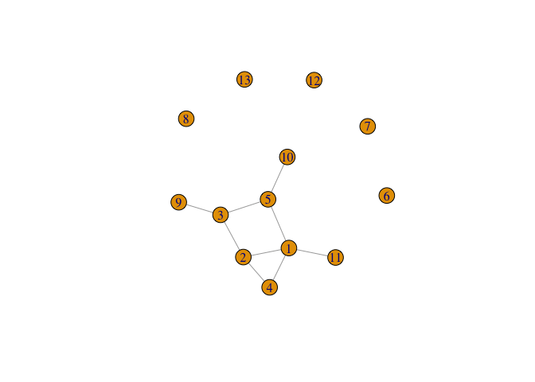
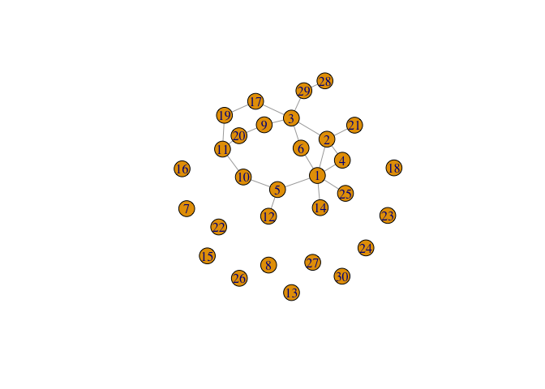
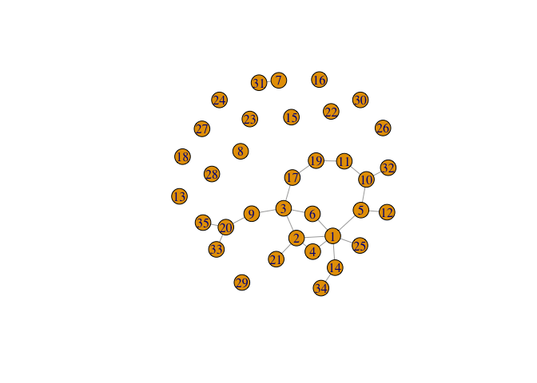
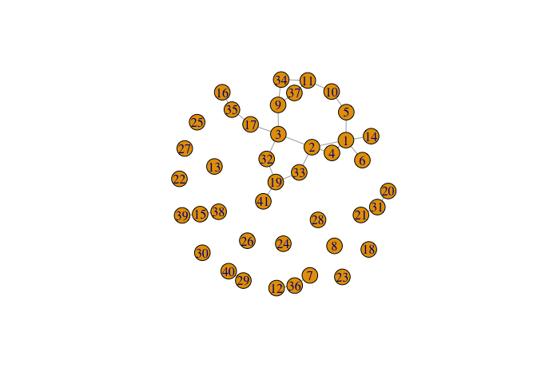

<!-- README.md is generated from README.Rmd. Please edit that file -->

# netseer 

<!-- badges: start -->

[](https://github.com/sevvandi/netseer/actions/workflows/R-CMD-check.yaml)
<!-- badges: end -->

The goal of netseer is to predict the graph structure including new
nodes and edges from a time series of graphs. The methodology is
explained in the preprint (Kandanaarachchi 2024). We will illustrate an
example in this vignette.

## Installation

You can install the development version of netseer from
[GitHub](https://github.com/) with:

``` r
# install.packages("devtools")
devtools::install_github("sevvandi/netseer")
```

## An example

This is a basic example which shows you how to predict a graph at the
next time point. First let us generate some graphs.

``` r
library(netseer)
library(igraph)
#> 
#> Attaching package: 'igraph'
#> The following objects are masked from 'package:stats':
#> 
#>     decompose, spectrum
#> The following object is masked from 'package:base':
#> 
#>     union

set.seed(2024)
edge_increase_val <- new_nodes_val <- del_edge_val <- 0.1
graphlist <- list()
graphlist[[1]] <- gr <-  igraph::sample_pa(5, directed = FALSE)
for(i in 2:15){
gr <-  generate_graph(gr,
                     del_edge = del_edge_val,
                     new_nodes = new_nodes_val,
                     edge_increase = edge_increase_val )
graphlist[[i]] <- gr
}
```

The *graphlist* contains the list of graphs we generated. Each graph is
an *igraph* object. Let’s plot a couple of them.

### Plotting a couple of graphs

``` r
plot(graphlist[[1]])
```


``` r

plot(graphlist[[8]])
```



``` r

plot(graphlist[[15]])
```

 \###
Predicting the next graph

Let’s predict the next graph. The argument

specifies we want to predict the graph at the next time point.

``` r
grpred <- predict_graph(graphlist[1:15],h = 1)
#> Warning: 2 errors (1 unique) encountered for arima
#> [2] missing value where TRUE/FALSE needed
#> Joining with `by = join_by(vertex)`
#> Joining with `by = join_by(From, To)`
#> Joining with `by = join_by(original)`
#> Joining with `by = join_by(original)`
grpred
#> $graph_mean
#> IGRAPH 29bf848 U--- 34 24 -- 
#> + edges from 29bf848:
#>  [1]  1-- 2  1-- 4  1-- 5  1-- 6  1--11  1--14  1--25  2-- 3  2-- 4  2--17
#> [11]  2--21  3-- 5  3-- 6  3-- 9  3--17  4-- 7  5--10  5--12  9--20 10--11
#> [21] 11--19 13--15 17--19 30--34
#> 
#> $graph_lower
#> NULL
#> 
#> $graph_upper
#> NULL

plot(grpred$graph_mean)
```



``` r
ecount(grpred$graph_mean)
#> [1] 24
vcount(grpred$graph_mean)
#> [1] 34
```

### Predicting the graph at 2 time steps ahead

Now let us predict the graph at 2 time steps ahead with
.

``` r
grpred2 <- predict_graph(graphlist[1:15], h = 2)
#> Warning: 2 errors (1 unique) encountered for arima
#> [2] missing value where TRUE/FALSE needed
#> Joining with `by = join_by(vertex)`
#> Joining with `by = join_by(From, To)`
#> Joining with `by = join_by(original)`
#> Joining with `by = join_by(original)`
grpred2
#> $graph_mean
#> IGRAPH 4a018e0 U--- 37 27 -- 
#> + edges from 4a018e0:
#>  [1]  1-- 2  1-- 4  1-- 5  1-- 6  1--11  1--14  1--25  2-- 3  2-- 4  2--17
#> [11]  2--21  3-- 5  3-- 6  3-- 9  3--17  4-- 7  5--10  5--12  9--20 10--11
#> [21] 11--19 13--15 17--19 30--34 30--35 30--36 30--37
#> 
#> $graph_lower
#> NULL
#> 
#> $graph_upper
#> NULL

plot(grpred2$graph_mean)
```


``` r
ecount(grpred2$graph_mean)
#> [1] 27
vcount(grpred2$graph_mean)
#> [1] 37
```

We see the predicted graph at

has more vertices and edges than the graph at
.

### Predicting the graph at 3 time steps ahead

Similarly, we can predict the graph at 3 time steps ahead. We don’t have
a limit on
.
But generally, as we get further into the future, the predictions are
less accurate. This is with everything, not just graphs.

``` r
grpred3 <- predict_graph(graphlist[1:15], h = 3)
#> Warning: 2 errors (1 unique) encountered for arima
#> [2] missing value where TRUE/FALSE needed
#> Joining with `by = join_by(vertex)`
#> Joining with `by = join_by(From, To)`
#> Joining with `by = join_by(original)`
#> Joining with `by = join_by(original)`
grpred3
#> $graph_mean
#> IGRAPH 7bbd63c U--- 40 29 -- 
#> + edges from 7bbd63c:
#>  [1]  1-- 2  1-- 4  1-- 5  1-- 6  1--11  1--14  1--25  2-- 3  2-- 4  2--17
#> [11]  2--21  3-- 5  3-- 6  3-- 9  3--17  4-- 7  5--10  5--12  9--20 10--11
#> [21] 11--19 13--15 17--19 30--35 30--36 30--37 30--38 30--39 30--40
#> 
#> $graph_lower
#> NULL
#> 
#> $graph_upper
#> NULL

plot(grpred3$graph_mean)
```



``` r
ecount(grpred3$graph_mean)
#> [1] 29
vcount(grpred3$graph_mean)
#> [1] 40
```

# References

<div id="refs" class="references csl-bib-body hanging-indent">

<div id="ref-kand2024graphpred" class="csl-entry">

Kandanaarachchi, Sevvandi. 2024. “Predicting the Structure of Dynamic
Graphs.” <https://arxiv.org/abs/2401.04280>.

</div>

</div>
