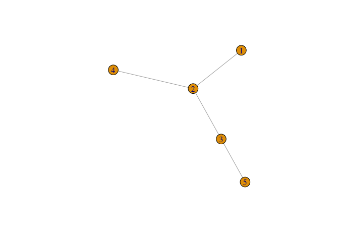
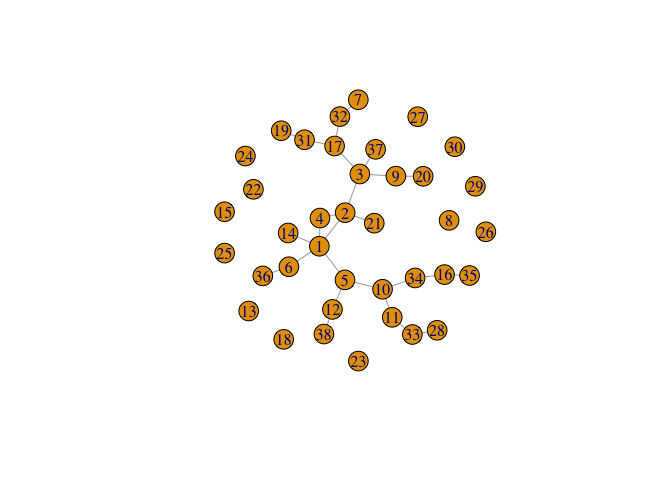

<!-- README.md is generated from README.Rmd. Please edit that file -->

# netseer 

<!-- badges: start -->

[](https://github.com/sevvandi/netseer/actions/workflows/R-CMD-check.yaml)
<!-- badges: end -->

The goal of netseer is to predict the graph structure including new
nodes and edges from a time series of graphs. The methodology is
explained in the preprint (Sevvandi Kandanaarachchi 2024). We will
illustrate an example in this vignette.

## Installation

You can install the development version of netseer from
[GitHub](https://github.com/) with:

``` r
# install.packages("devtools")
devtools::install_github("sevvandi/netseer")
```

## An example

This is a basic example which shows you how to predict a graph at the
next time point. First let us generate some graphs.

``` r
library(netseer)
library(igraph)
#> 
#> Attaching package: 'igraph'
#> The following objects are masked from 'package:stats':
#> 
#>     decompose, spectrum
#> The following object is masked from 'package:base':
#> 
#>     union

set.seed(2024)
edge_increase_val <- new_nodes_val <- del_edge_val <- 0.1
graphlist <- list()
graphlist[[1]] <- gr <-  igraph::sample_pa(5, directed = FALSE)
for(i in 2:15){
gr <-  generate_graph_exp(gr,
                          del_edge = del_edge_val,
                          new_nodes = new_nodes_val,
                          edge_increase = edge_increase_val )
graphlist[[i]] <- gr
}
```

The *graphlist* contains the list of graphs we generated. Each graph is
an *igraph* object. Let’s plot a couple of them.

### Plotting a couple of graphs

``` r
plot(graphlist[[1]])
```



``` r

plot(graphlist[[8]])
```


``` r

plot(graphlist[[15]])
```

 \###
Predicting the next graph

Let’s predict the next graph. The argument $h = 1$ specifies we want to
predict the graph at the next time point.

``` r
grpred <- predict_graph(graphlist[1:15],h = 1)
#> Warning: 2 errors (1 unique) encountered for arima
#> [2] missing value where TRUE/FALSE needed
#> Registered S3 method overwritten by 'quantmod':
#>   method            from
#>   as.zoo.data.frame zoo
grpred
#> $graph_mean
#> IGRAPH bb1ab36 U--- 35 23 -- 
#> + edges from bb1ab36:
#>  [1] 17--19 11--19 10--11  9--20  5--12  5--10  3--17  3-- 9  3-- 6  2--21
#> [11]  2-- 4  2-- 3  1--25  1--14  1-- 6  1-- 5  1-- 4  1-- 2  7--31 10--32
#> [21] 20--33 14--34 20--35
#> 
#> $graph_lower
#> NULL
#> 
#> $graph_upper
#> NULL

plot(grpred$graph_mean)
```


``` r
ecount(grpred$graph_mean)
#> [1] 23
vcount(grpred$graph_mean)
#> [1] 35
```

### Predicting the graph at 2 time steps ahead

Now let us predict the graph at 2 time steps ahead with $h=2$.

``` r
grpred2 <- predict_graph(graphlist[1:15], h = 2)
#> Warning: 2 errors (1 unique) encountered for arima
#> [2] missing value where TRUE/FALSE needed
grpred2
#> $graph_mean
#> IGRAPH 35d87d4 U--- 38 26 -- 
#> + edges from 35d87d4:
#>  [1] 10--11  9--20  5--12  5--10  3--17  3-- 9  2--21  2-- 4  2-- 3  1--14
#> [11]  1-- 6  1-- 5  1-- 4  1-- 2 19--31 17--31 17--32  7--32 11--33 28--33
#> [21] 16--34 10--34 16--35  6--36  3--37 12--38
#> 
#> $graph_lower
#> NULL
#> 
#> $graph_upper
#> NULL

plot(grpred2$graph_mean)
```



``` r
ecount(grpred2$graph_mean)
#> [1] 26
vcount(grpred2$graph_mean)
#> [1] 38
```

We see the predicted graph at $h=2$ has more vertices and edges than the
graph at $h=1$.

### Predicting the graph at 3 time steps ahead

Similarly, we can predict the graph at 3 time steps ahead. We don’t have
a limit on $h$. But generally, as we get further into the future, the
predictions are less accurate. This is with everything, not just graphs.

``` r
grpred3 <- predict_graph(graphlist[1:15], h = 3)
#> Warning: 2 errors (1 unique) encountered for arima
#> [2] missing value where TRUE/FALSE needed
grpred3
#> $graph_mean
#> IGRAPH 2ac93a1 U--- 41 29 -- 
#> + edges from 2ac93a1:
#>  [1] 10--11  5--10  3--17  3-- 9  2-- 4  2-- 3  1--14  1-- 6  1-- 5  1-- 4
#> [11]  1-- 2 21--31 20--31 19--32  3--32 19--33  2--33  9--34 11--34 17--35
#> [21] 16--35 12--36  7--36  9--37 11--37 15--38 15--39 29--40 19--41
#> 
#> $graph_lower
#> NULL
#> 
#> $graph_upper
#> NULL

plot(grpred3$graph_mean)
```


``` r
ecount(grpred3$graph_mean)
#> [1] 29
vcount(grpred3$graph_mean)
#> [1] 41
```

# References

<div id="refs" class="references csl-bib-body hanging-indent">

<div id="ref-kand2024graphpred" class="csl-entry">

Sevvandi Kandanaarachchi, Stefan Westerlund, Ziqi Xu. 2024. “Predicting
the Structure of Dynamic Graphs.” <https://arxiv.org/abs/2401.04280>.

</div>

</div>
