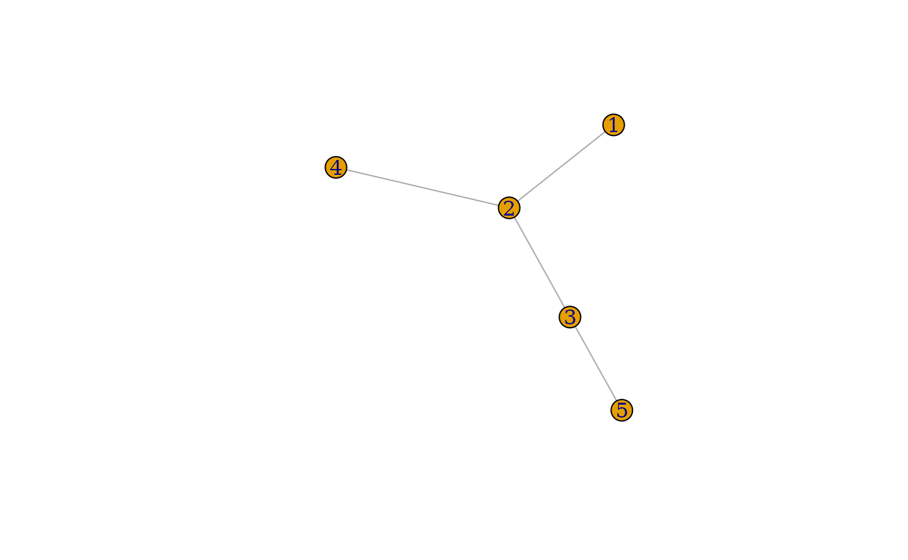
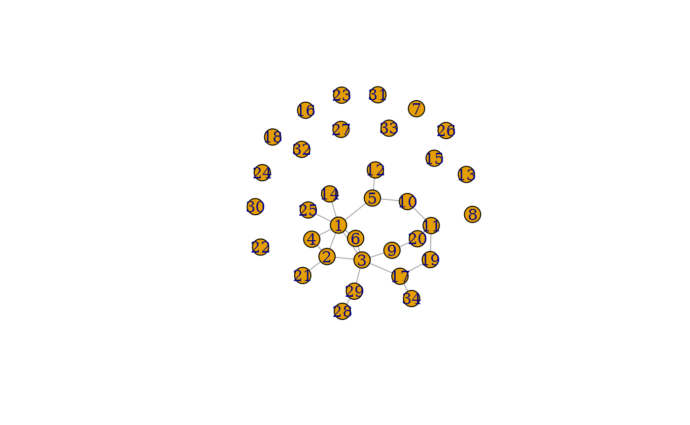
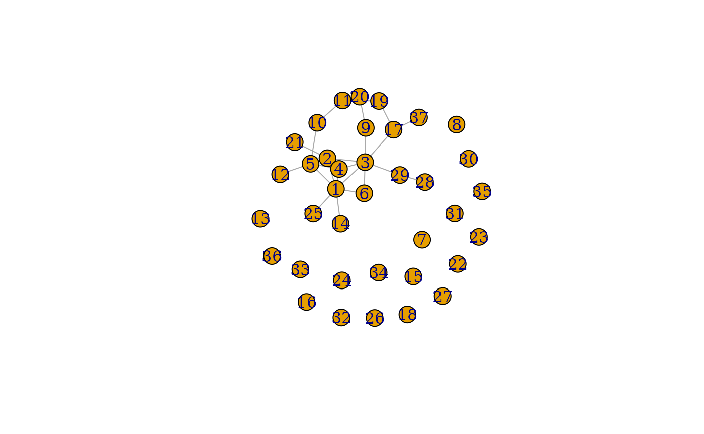
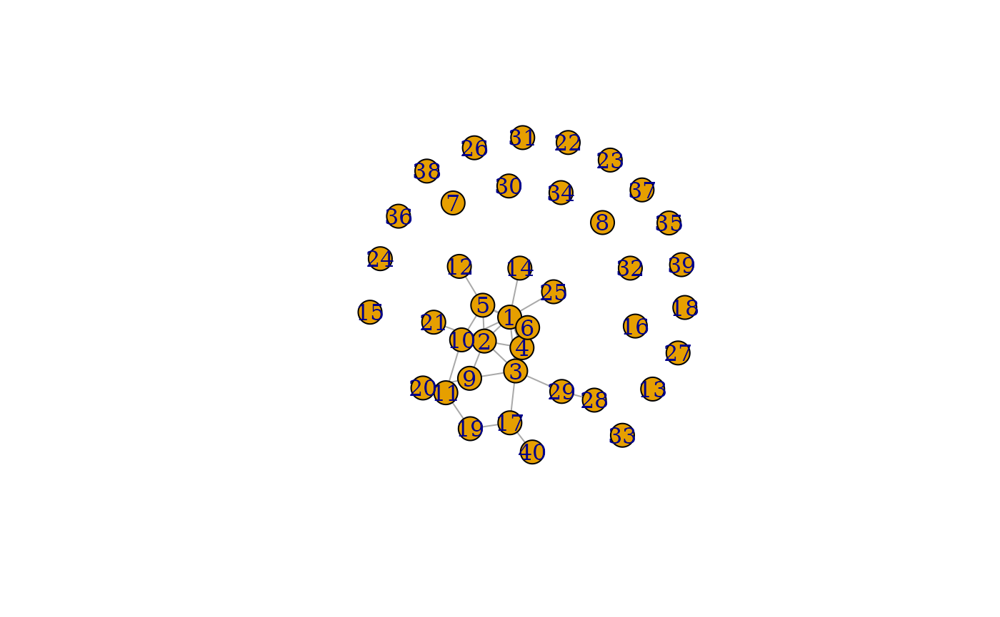

# The R package netseer

## netseer 

[](https://github.com/sevvandi/netseer/actions/workflows/R-CMD-check.yaml)

The goal of netseer is to predict the graph structure including new
nodes and edges from a time series of graphs. The methodology is
explained in the preprint (Kandanaarachchi et al. 2025). We will
illustrate an example in this vignette.

### Installation

You can install the development version of netseer from
[GitHub](https://github.com/) with:

``` r
# install.packages("devtools")
devtools::install_github("sevvandi/netseer")
```

### An example

This is a basic example which shows you how to predict a graph at the
next time point. First let us generate some graphs.

``` r
library(netseer)
library(igraph)
#> 
#> Attaching package: 'igraph'
#> The following objects are masked from 'package:stats':
#> 
#>     decompose, spectrum
#> The following object is masked from 'package:base':
#> 
#>     union

set.seed(2024)
edge_increase_val <- new_nodes_val <- del_edge_val <- 0.1
graphlist <- list()
graphlist[[1]] <- gr <-  igraph::sample_pa(5, directed = FALSE)
for(i in 2:15){
gr <-  generate_graph_exp(gr,
                          del_edge = del_edge_val,
                          new_nodes = new_nodes_val,
                          edge_increase = edge_increase_val )
graphlist[[i]] <- gr
}
```

The *graphlist* contains the list of graphs we generated. Each graph is
an *igraph* object. Let’s plot a couple of them.

#### Plotting a couple of graphs

``` r
plot(graphlist[[1]])
```



``` r

plot(graphlist[[8]])
```


``` r

plot(graphlist[[15]])
```


#### Predicting the next graph

Let’s predict the next graph. The argument $h = 1$ specifies we want to
predict the graph at the next time point.

``` r
grpred <- predict_graph(graphlist[1:15],h = 1)
#> Registered S3 method overwritten by 'tsibble':
#>   method               from 
#>   as_tibble.grouped_df dplyr
#> Warning: 2 errors (1 unique) encountered for arima
#> [2] missing value where TRUE/FALSE needed
#> Registered S3 method overwritten by 'quantmod':
#>   method            from
#>   as.zoo.data.frame zoo
grpred
#> $graph_mean
#> IGRAPH bf2e41c U--- 34 23 -- 
#> + edges from bf2e41c:
#>  [1]  1-- 2  1-- 4  1-- 5  1-- 6  1--14  1--25  2-- 3  2-- 4  2--21  3-- 6
#> [11]  3-- 9  3--17  3--29  5--10  5--12  9--20 10--11 11--19 11--20 17--19
#> [21] 28--29  1-- 3 17--34
#> 
#> $graph_lower
#> NULL
#> 
#> $graph_upper
#> NULL

plot(grpred$graph_mean)
```



``` r
ecount(grpred$graph_mean)
#> [1] 23
vcount(grpred$graph_mean)
#> [1] 34
```

#### Predicting the graph at 2 time steps ahead

Now let us predict the graph at 2 time steps ahead with $h = 2$.

``` r
grpred2 <- predict_graph(graphlist[1:15], h = 2)
#> Warning: 2 errors (1 unique) encountered for arima
#> [2] missing value where TRUE/FALSE needed
grpred2
#> $graph_mean
#> IGRAPH f209e3f U--- 37 26 -- 
#> + edges from f209e3f:
#>  [1]  1-- 2  1-- 4  1-- 5  1-- 6  1--14  1--25  2-- 3  2-- 4  2--21  3-- 6
#> [11]  3-- 9  3--17  3--29  5--10  5--12  9--20 10--11 11--19 11--20 17--19
#> [21] 28--29  1-- 3  3-- 4  2-- 5  4-- 5 17--37
#> 
#> $graph_lower
#> NULL
#> 
#> $graph_upper
#> NULL

plot(grpred2$graph_mean)
```



``` r
ecount(grpred2$graph_mean)
#> [1] 26
vcount(grpred2$graph_mean)
#> [1] 37
```

We see the predicted graph at $h = 2$ has more vertices and edges than
the graph at $h = 1$.

#### Predicting the graph at 3 time steps ahead

Similarly, we can predict the graph at 3 time steps ahead. We don’t have
a limit on $h$. But generally, as we get further into the future, the
predictions are less accurate. This is with everything, not just graphs.

``` r
grpred3 <- predict_graph(graphlist[1:15], h = 3)
#> Warning: 2 errors (1 unique) encountered for arima
#> [2] missing value where TRUE/FALSE needed
grpred3
#> $graph_mean
#> IGRAPH a66463b U--- 40 29 -- 
#> + edges from a66463b:
#>  [1]  1-- 2  1-- 4  1-- 5  1-- 6  1--14  1--25  2-- 3  2-- 4  2--21  3-- 6
#> [11]  3-- 9  3--17  3--29  5--10  5--12  9--20 10--11 11--19 11--20 17--19
#> [21] 28--29  1-- 3  3-- 4  2-- 5  4-- 6  5-- 6  2-- 9  1--10 17--40
#> 
#> $graph_lower
#> NULL
#> 
#> $graph_upper
#> NULL

plot(grpred3$graph_mean)
```



``` r
ecount(grpred3$graph_mean)
#> [1] 29
vcount(grpred3$graph_mean)
#> [1] 40
```

## References

Kandanaarachchi, Sevvandi, Ziqi Xu, Stefan Westerlund, and Conrad
Sanderson. 2025. “Predicting Graph Structure via Adapted Flux Balance
Analysis.” <https://arxiv.org/abs/2507.05806>.
